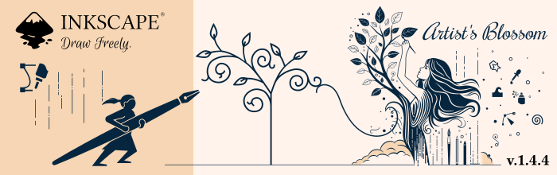

# Vibescape

Vibescape is an independent, personal learning fork of [Inkscape](https://inkscape.org/).
It is our workshop for understanding a large open source application, improving our
Windows development workflow, and experimenting with its interface and visual identity.
Development is assisted by AI tools and reviewed within the limits of our experience.

## With thanks to Inkscape

Vibescape exists because of the work of Inkscape's developers, artists, translators,
documenters, testers, and the maintainers of its dependencies. The vector editor and
the overwhelming majority of this code are their work. We are grateful for the
opportunity to study and build on it.

Vibescape is independently maintained and is not affiliated with, endorsed by, or
supported by the Inkscape project. We take responsibility for our changes and for
supporting this fork. Please keep Vibescape questions and problems in
[this repository](https://github.com/nuxboxen/Vibescape/issues), rather than asking
Inkscape's volunteers to support our experiments.

For everyday vector graphics work, please visit the
[official Inkscape project](https://inkscape.org/) and its
[download page](https://inkscape.org/release/).
You can also [support or contribute to Inkscape](https://inkscape.org/contribute/)
through its own community.

## Project scope and distribution

This repository is a place to share source code, experiments, and what we learn.
**We do not plan to ever distribute prebuilt Vibescape binaries, installers, or
binary release archives.** Local builds are part of our own development work.

Our current focus is the Windows build process, clearer developer documentation,
and Vibescape's own labeling and artwork. We have no plans to submit this fork's
changes upstream. Any future contribution would be a separate, deliberate discussion
with the Inkscape project, following its wishes and contribution process.

## Security and running code

> [!WARNING]
> **Do not blindly compile or run code from this repository, or any other repository.**
> We are not security experts. We have not performed a security audit, and we do not
> know whether this fork, our changes, or its full dependency and build chain are safe
> to run. A successful build, a working application, or passing tests does not
> establish safety.

Public source code, a familiar upstream project, and AI-assisted development are
not assurances of security. Build scripts, dependency installers, and extensions
also execute code; the risk does not begin only when the application launches.

Read and understand what you intend to execute, including the build scripts and
dependencies, and seek qualified review where needed. **If you cannot assess the
risk, do not build or run it.** Deliberate experiments should use an isolated,
disposable environment without sensitive files or credentials. Isolation reduces
exposure; it is not a guarantee of safety.

These statements describe our fork and the limits of our own review. They are not
an assessment of the security of official Inkscape releases.

## Current development status

- A local Windows development build has compiled and opened the editor. Focused
  checks have run; known test failures and limitations are recorded in the
  [Windows development notes](doc/building/vibescape-windows.md).
- The Windows build helper reuses unchanged configuration and updates the local
  runnable folder when build inputs change.
- The Vibescape launcher uses its own preferences directory. This separates
  preferences; it does not sandbox the application.
- Windows application icons and the opening splash use Vibescape artwork.
  Many application labels and executable filenames still use Inkscape's name.

This is experimental development work. Build results and documentation describe
what we have tried, without claiming a completed security review or release readiness.

## Interface layout

The Object Properties panel places **Description** above **Selection**, keeping
Title, Description, and ID together at the top. The section opens by default and
remembers your choice when you collapse or expand it.

## Source and development documentation

Start by reading the [security guidance above](#security-and-running-code).
The linked instructions document our development workflow; they are not a
recommendation to execute unfamiliar code.

- [Source snapshot, dependency provenance, and checkout instructions](VIBESCAPE.md)
- [Vibescape Windows setup, build, launch, and validation notes](doc/building/vibescape-windows.md)
- [Contribution guidance](CONTRIBUTING.md)
- [Retained Inkscape developer documentation](doc/readme.md)

The initial import retained upstream history, branches, tags, licenses, and credits.
All 13 recursive source submodules are mirrored in companion repositories under
[nuxboxen](https://github.com/nuxboxen). Compilers and platform libraries still come
from their respective package sources; this repository is not a complete offline
build environment.

For a reviewed local build, the project launcher is `Run-Vibescape.cmd`; the
runnable application is under `build/windows/install/bin/`. The separate
`build/windows/bin/` directory contains compiler output without the complete
packaged runtime. See the Windows notes before using either.

## Credits and licensing

Original authorship, copyright notices, and licensing are retained. See
[AUTHORS](AUTHORS), [COPYING](COPYING), [LICENSES](LICENSES/), and the notices in
individual files and dependencies. Our distribution plans do not change those
licenses.

[Inkscape's upstream source](https://gitlab.com/inkscape/inkscape) remains the
reference for the original project. Retained upstream documentation and historical
branches may describe Inkscape workflows or releases; they do not establish
Vibescape release or support commitments.
