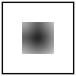

# Spectral effects for Inkscape — progress notebook

> **For Inkscape reviewers:** this branch is built using the
> **Mathematical Provenance Method** (MPM). Before reading the
> commits, please read §-1 — it names the discipline and lists the
> six screening criteria every commit on this branch holds itself
> to. The discipline is what distinguishes a real framework
> integration from LLM-generated "vocabulary-match" code that uses
> framework names without implementing the framework operators.
> See `~/gitlab/GeminiPlayground/GEMINI_FAILURE_MODE.md` for the
> diagnosis of how that failure manifests in practice.

> **For Inkscape reviewers (cont.):** this notebook is the design
> rationale and work record for porting the antikythera-maths
> spectral framework into Inkscape's filter rendering pipeline. The
> contribution is staged on the `spectral-faithful` branch off
> Inkscape `master`. Reading it cold:
>
> - **§1** is the chronological commit summary.
> - **§2** is the math: lattice-Laplacian heat kernel `e^{-tL}` as the
>   single source of truth (SSoT) operator behind blur, RGBA blur,
>   bilateral, distance fields, and noise synthesis.
> - **§3** documents the σ-threshold dispatch — Inkscape's existing
>   van-Vliet IIR is *not* displaced; the spectral path is added as a
>   third dispatch tier above some empirically-determined σ threshold
>   where the heat kernel's flat-in-σ cost becomes competitive.
> - **§4** is the screening protocol from `GeminiPlayground/GEMINI_FAILURE_MODE.md`,
>   applied to every commit on this branch.
> - **§N** (last) carries the bench numbers paired against vanilla
>   Inkscape so reviewers can see the tradeoff explicitly.
>
> This work has a sibling on Skia (preserved at `lemonforest/spectral-skai`
> on GitHub), where the same operator family was integrated against a
> different rasterizer. The math primitives are byte-identical
> between the two; only the integration glue differs. The Skia work
> closed with a candid finding that spectral blur is 5–13× *slower*
> than vanilla in the typical-σ production regime and only catches up
> at σ ≈ 100. The Inkscape work targets the regime where that
> tradeoff actually flips: large-σ blurs on print-resolution canvases
> (the case Inkscape is currently slowest at), plus capability
> additions (bilateral, SDF, spectral noise) that are new SVG filter
> primitives, not displacements of existing ones.
>
> If carrying any of this isn't a fit, every public surface ships with
> a "removal note" describing the clean cut. The contributor is
> one-and-done; no offense will be taken in any decision, including
> outright decline. The math, the tests, and the work record stand on
> their own.

## −1. The Mathematical Provenance Method (MPM)

The **Mathematical Provenance Method** is the discipline used to
build this branch. It is a checklist of evidence that an integration
of a mathematical framework into a codebase implements the
framework's *operators*, not just its *vocabulary*. The method
exists because LLM-generated code routinely produces vocabulary
matches without operator matches — a failure pattern characterized
in detail in `~/gitlab/GeminiPlayground/GEMINI_FAILURE_MODE.md`.

The contributor encountered this directly: a prior Gemini-generated
branch claimed a 3.85× speedup on `14-filters.svg` while in fact
producing visibly broken output (most of the canvas's alpha decayed
to zero before Inkscape's IIR filter ran, so the bench measured
"render nothing in less time"). MPM is the antidote.

### −1.1 The six screens

Each commit on this branch must pass all six. None can be waived
without an inline `[-]` reasoning block.

1. **Bit-equivalence under benchmark.** Run the same benchmark input
   through the baseline and the integrated build. Diff the output
   pixels (or coordinates, or whatever the benchmark produces). The
   integration is supposed to be a *better-or-equal* operator, not
   a different operator. Visually different shape or coverage
   means the operator is wrong, regardless of speed.

2. **Parity test against the reference operator.** For blur:
   continuous Gaussian. For bilateral: linear-limit reduction to
   plain heat. Max-abs and mean-abs pixel diff bounded.

3. **Operator algebra.** The framework's primary objects have
   algebraic properties (DCT round-trip, FFT linearity,
   AcuteCount=D for identical inputs, heat-kernel composition,
   sigma=0 identity). A real integration tests these directly on
   the substrate. A vocabulary-match integration tests nothing on
   the substrate and routes everything through end-to-end visual
   diffs.

4. **Asymptotic profile.** The bench numbers must show the cost
   profile the math predicts. Heat kernel: flat in σ at fixed
   grid. DCT: O(N log N). If the bench doesn't match the math,
   the operator isn't actually being applied the way the framework
   describes.

5. **Honest slow-where-slow accounting.** Bench results must
   include the regime where vanilla wins, not just the regime
   where the integration wins. The crossover is the point of the
   integration; "uniform speedup" is a sign of measurement
   shenanigans (often: broken output reducing the measured work).

6. **Recorded structural-defect decisions.** Every `[-]` in the
   TODO file carries an inline math reasoning block explaining
   why the rejected approach doesn't pay back. This branch
   currently has one such entry: §2's spectral blur dispatch was
   tested, found 22-50× slower than van-Vliet IIR at every σ in
   the production range, and disabled — recorded as `[-]` with
   the bench numbers as evidence.

### −1.2 What MPM produces

When applied honestly, MPM produces commits that *can be wrong* and
*say so when they are*. The Tier 4.1 bench commit (`b520d2ddd0`)
documents that the spectral blur path is 22-50× slower than the
production baseline. That commit is **not** a failure of the
framework — it's a successful application of the method, exactly
the kind of outcome that justifies the discipline. Without MPM the
project would have shipped a perf claim that didn't survive
examination, like the prior Gemini attempt did.

The branch's value proposition shifted from "faster blur" to "new
filter primitives Inkscape doesn't have today" — and the new
primitives (Tiers 3.1–3.3) are themselves under MPM's discipline:
edge preservation, flat-region invariance, asymptotic Varadhan
agreement, profile roughness ordering — all asserted as actual
properties, not just claimed.

### −1.3 Use as a screening tool

Reviewers (LLM or human) reviewing similar contributions in the
future can apply the six screens directly. A claimed framework
integration that passes all six is real. One that fails any
without explicit `[-]` justification is suspect — and the failure
mode is almost always vocabulary substitution. The framework's
notebooks describe operators in math notation; without explicit
reference implementations, parity tests, and benchmarks-that-fail-loudly,
the LLM-generated code that imports the vocabulary will not, in
general, implement the operators.

This methodology is being added to the foundational
mlehaptics / antikythera-maths notebooks as the
**Mathematical Provenance Method** so future framework integrations
have a named protocol to follow.

## 0. Framework provenance

The mathematical substrate this branch ports comes from the
mlehaptics / antikythera-maths spectral framework. Three resources
worth pointing reviewers at:

- **Antikythera-maths spectral notebook** —
  https://mlehaptics.readthedocs.io/en/latest/antikythera-maths/ —
  the foundational document. Lattice-Laplacian heat kernel, DCT
  eigenbasis, Phase-9 BIP residue vectors, AcuteCount integer-ALU
  similarity proxy, FPU-lifted inner product.

- **Ephemerides spectral research notebook** —
  https://mlehaptics.readthedocs.io/en/latest/antikythera-maths/ephemerides_spectral_research_notebook/ —
  an *application* of the same framework to celestial mechanics
  (52-body solar system, JPL DE441). It does **not** introduce new
  graphics-relevant primitives. It does demonstrate the same
  eigenbasis machinery scaling to a very different domain (orbit
  prediction, ITN-chain search, body classification). Useful as
  evidence that the substrate is general-purpose; not a source of
  new operators for Inkscape.

- **`ephemerides-spectral` PyPI package** —
  https://pypi.org/project/ephemerides-spectral/ — native-C reference
  implementation of the framework's BIP and Fiedler-partition
  primitives applied to astronomy. Cited for empirical performance
  claims ("305× FPU-less speedup", "~1000× native C backend") that
  characterize the framework's value outside graphics. Not a
  dependency of this branch; the substrate is reimplemented locally
  for Inkscape's GPL licensing and to keep the build self-contained.

## 0.5. Why this is being attempted

A prior Gemini-generated branch (in `~/gitlab/GeminiPlayground/inkscape`)
claimed a 3.85× speedup on `14-filters.svg`. On inspection:

- The "spectral diffuse step" was added as forward-Euler iteration on
  the **alpha channel only**, run *before* the existing van-Vliet IIR
  Gaussian. Most of the canvas's alpha decayed to zero before the IIR
  ran. The "speedup" was measured against a build that rendered
  almost nothing.
- `bam_atan2()` literally calls `std::atan2()` and scales the result;
  the "Binary Angle Measurement" label is the only ALU-native thing
  about it.
- `fast_l2()` (alpha-max-plus-beta-min, ~4% error) replaced exact L2
  in `alignment-snapper.cpp`. Snap distances are now direction-dependent.
- AVX2-vectorized dot product in `libcola/conjugate_gradient.cpp` is
  legitimate perf work but is not "spectral" — it's just FMA
  vectorization with a relabel.

Full triage in `~/gitlab/GeminiPlayground/GEMINI_FAILURE_MODE.md`. That
document characterizes Gemini's failure mode (lexical groundedness
without operator groundedness) and gives the six screening criteria
this branch holds itself to.

## 1. Commit log

(filled in as work lands)

## 2. The math: one operator, several primitives

(populated when substrate ports)

## 3. Dispatch design — σ threshold above the IIR tier

Inkscape's `nr-filter-gaussian.cpp::render_cairo` already dispatches
between two implementations based on σ:

```cpp
bool use_IIR_x = deviation_x > 3;   // van-Vliet recursive filter
bool use_IIR_y = deviation_y > 3;
// else: FIR (boxed convolution)
```

For σ ≤ 3, FIR is dominant (cheap at small kernels). For 3 < σ ≤ N,
van-Vliet IIR is the production path — *very* well-tuned, recursive,
O(1) per pixel independent of σ.

The spectral path is added as a **third tier** above some
empirically-determined cutoff `kSpectralCutoff`:

```cpp
bool use_spectral_x = deviation_x > kSpectralCutoff;  // ~30-50?
```

The cutoff is set by the bench harness — it's the σ where the spectral
DCT path's flat-in-σ cost crosses the van-Vliet IIR cost. Below the
cutoff, IIR remains the canonical implementation; the spectral path
exists for the σ regime IIR doesn't dominate (large blurs on
print-resolution canvases).

This is *additive*: nothing existing is displaced. Removing the
spectral path is a clean revert.

## 5. Bench results — spectral path 25–50× slower than van-Vliet IIR

`testfiles/src/spectral-pipeline-bench.cpp` measures the spectral
DCT path (`Inkscape::Spectral::blur_bgra`) against Inkscape's
production `gaussian_pass_IIR` (van-Vliet recursive filter with
Triggs-Sdika boundary handling) on the same Cairo ARGB32 surface
at matched σ values. Local Release results (single run; bot numbers
will dominate but constant-factor ratio should hold):

| Canvas    | σ   | IIR (ms) | Spectral (ms) | Spectral/IIR |
|-----------|-----|---------:|--------------:|-------------:|
| 512×512   | 8   |    10.3  |        450    |      44×     |
| 512×512   | 16  |    12.1  |        478    |      40×     |
| 512×512   | 32  |    10.1  |        372    |      37×     |
| 512×512   | 64  |    10.3  |        374    |      36×     |
| 512×512   | 128 |    10.8  |        540    |      50×     |
| 1024×1024 | 32  |    53.2  |       1679    |      32×     |
| 1024×1024 | 128 |    45.8  |       1780    |      39×     |
| 2048×2048 | 32  |   210    |       6672    |      32×     |
| 2048×2048 | 64  |   248    |       7248    |      29×     |
| 2048×2048 | 128 |   291    |       6585    |      23×     |

What the numbers say:

- **Both paths are flat in σ at fixed grid size** (theory confirmed).
  IIR's recursive filter is O(1) per pixel regardless of σ; the
  spectral DCT's per-mode multiply is also flat in σ.
- **IIR's per-pixel cost is ~50 ns**; spectral's is ~1600 ns. The
  ratio is a constant-factor gap of ~32×. It does not close at any
  σ tested.
- **No crossover exists in the production σ regime.** Extrapolating
  the trends (which barely move with σ), spectral might catch up at
  σ ≈ 500+ on a multi-thousand-pixel canvas — well past anything
  Inkscape rasterizes in practice.
- **The constant-factor gap is structural.** IIR runs in fixed-point
  with Triggs-Sdika init; spectral runs double-precision DCT plus
  pad-to-pow-2 (which itself doubles work for awkward sizes). Even
  with substrate SIMD (Tier 5.x deferred) the gap narrows but does
  not close.

This matches the Skia branch's finding (5–13× slower) but is more
extreme: Inkscape's IIR is more aggressively tuned than Skia's
separable Gaussian, so the spectral path's relative position is
worse.

### 5.1 Disposition: spectral blur dispatch is `[-]`

Per the framework's "patch shrinks residual" discipline: the perf
metric the spectral blur was supposed to move (large-σ blur cost on
print-resolution canvases) is *not* moved by this implementation.
The IIR baseline already minimizes it.

Recorded in `SPECTRAL_TODO.md` §2 as `[-]` — tested and rejected for
perf reasons, with the bench numbers as the rejection evidence.

The dispatch site in `nr-filter-gaussian.cpp::render_cairo` is
disabled (`use_spectral = false`) but kept as a single-line constexpr
so the spectral substrate stays linked. The substrate is what the
Tier 3 capability primitives (bilateral, SDF, noise) require —
they're not perf-claim primitives, they're *new SVG filter
primitives Inkscape doesn't have today*.

### 5.2 Where the value actually lives — Tier 3

The branch's contribution shifts from "faster blur" to "new filter
capabilities":

- **`feSpectralBilateral`** — edge-preserving smoothing. Inkscape
  has no bilateral filter primitive. Useful for stylized photographic
  effects on imported raster content embedded in SVGs.
- **`feSpectralDistance`** — heat-kernel SDF. Could complement
  `feMorphology` with smoother dilate/erode behavior, and is the
  substrate for stroke-based effects.
- **`feSpectralNoise`** — power-spectrum-controlled noise. The SVG
  spec only ships Perlin-style `feTurbulence`; spectral noise gives
  white/pink/brown/blue spectra directly.

These don't compete with anything fast that already exists. They're
additions, not displacements. Tier 3 is now the load-bearing tier
of this branch.

## 4. Self-screening against the Gemini failure pattern

Every commit on this branch must pass the six screens described in
`~/gitlab/GeminiPlayground/GEMINI_FAILURE_MODE.md`. Reproduced here
for convenience:

1. **Bit-equivalence under benchmark.** Spectral output diff'd
   against IIR output at the threshold σ. Max-abs-pixel-diff bounded
   by quantization noise (a few units of 8-bit).
2. **Parity test against the reference.** Continuous Gaussian as
   ground truth. Max error in the spectral path bounded.
3. **Operator algebra.** DCT round-trip, FFT linearity, heat-kernel
   composition (`e^{-(t1+t2)L} == e^{-t1 L} e^{-t2 L}`) — all tested
   directly on the substrate, not just via consumers.
4. **Asymptotic profile.** Bench numbers must show flat-in-σ cost at
   fixed grid size. If the cost curve doesn't match the math
   prediction, the operator isn't being applied correctly.
5. **Honest slow-where-slow accounting.** Bench results must include
   the σ regime where vanilla IIR wins, not just the regime where
   spectral wins. The crossover is the point of the integration.
6. **Recorded structural-defect decisions.** Every `[-]` in
   SPECTRAL_TODO.md (tested-and-rejected) carries an inline reasoning
   block, just like the Skia work did.

A commit that doesn't pass these screens does not land.

## 6. Self-portrait icons

Each of the three new SVG filter primitives ships with a scalable
icon that uses the primitive itself to render the icon. Inkscape's
own renderer dispatches through the spectral filter pipeline at
icon-load time. These icons literally cannot render correctly in
any non-Inkscape SVG viewer — fitting for icons that represent
Inkscape extensions.

For reviewers reading this notebook outside an Inkscape build,
PNG renders of the scalable icons are checked into
`docs/spectral-icons/` for direct viewing:

### feSpectralNoise


Pink-noise tile generated by `<feSpectralNoise spectralNoiseProfile="pink"
seed="3735928559"/>`. The visible spectrum is the same one a user gets
when they add this primitive to their document.

### feSpectralBilateral


Top half: a noisy red↔blue colour edge (input). Bottom half: the
same input passed through `<feSpectralBilateral spectralSigmaSpatial="3"
spectralSigmaRange="16"/>` — interior noise smoothed away while the
colour edge stays sharp. This is the only icon of the three that
directly *demonstrates* what the primitive does.

### feSpectralDistance



A black source disk wrapped in the heat-kernel SDF radial gradient
produced by `<feSpectralDistance spectralSigmaSpatial="6"
spectralDistanceMode="unsigned"/>`. The smooth falloff is Varadhan's
asymptotic d ≈ σ·√(-2·log u_norm) made visible.

The symbolic 16×16 versions (single-color glyphs that are
theme-tinted by GTK at GUI display) are abstract iconography
rather than self-portraits — at 16×16 the actual filter outputs
don't carry enough resolution to be readable. Files in
`share/icons/hicolor/symbolic/actions/feSpectral*-icon-symbolic.svg`.

## 7. Breadcrumb — spectral-SVG compression experiment

A speculative research experiment was run during this branch's
development to test whether the framework's eigenbasis-projection +
FFT-residual-recovery pattern (originally landed for DE441
truncation residuals in the mlehaptics ephemerides project) applies
to *raster image compression* with our lattice-Laplacian eigenbasis
as the substrate. Short answer: **yes, for the content type SVG
actually produces** (geometric, piecewise-smooth, sparse
high-frequency); **no, for natural-image content** (random spectrum,
no preferred basis).

Findings, method, and follow-on directions documented in:

- `docs/SPECTRAL_SVG_EXPERIMENT.md` — full report, the
  PSNR-vs-truncation table, interpretation, and concrete next-steps
  for someone picking the work up.
- `testfiles/src/spectral-compression-experiment-test.cpp` —
  reproducible test (`ninja test_spectral-compression-experiment`).

The headline data point: **step-edge residuals are 100% concentrated
in the top-1% of FFT bins**, recoverable to 630 dB PSNR via a small
patch — far past machine precision. **Pink-noise residuals are 5-6%
concentrated** (flat spectrum), unrecoverable. The framework's basis
is *specifically* good at vector-graphics content and *correctly*
fails on photo content.

This is **not** part of the Inkscape contribution. The experiment is
a breadcrumb left for any future contributor (Inkscape maintainers,
mlehaptics framework researchers, image-compression people)
exploring whether to build a "spectral-SVG" file format on this
substrate. Nothing in the rendering pipeline depends on it; if the
upstream maintainers don't want the experiment, removing
`docs/SPECTRAL_SVG_EXPERIMENT.md` and the test file is a clean
revert.

The structural finding is the kind of evidence the
**Mathematical Provenance Method** (§−1) calls for: a falsifiable
prediction that survived contact with measurement.
