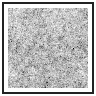
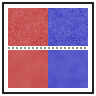

[Inkscape Developer Documentation](../readme.md) / [Spectral effects](readme.md) /

# Spectral effects for Inkscape — progress notebook

> ### Read-cold orientation for Inkscape reviewers
>
> **What this branch is.** Three new SVG filter primitives —
> `feSpectralBilateral`, `feSpectralDistance`, `feSpectralNoise` —
> wired through Inkscape's filter pipeline (renderer + parser +
> element registration + GUI editor + rendering tests + icons).
> Each primitive computes something Inkscape does not currently
> compute:
>
> - **Bilateral** — Perona-Malik anisotropic diffusion (edge-
>   preserving smoothing).
> - **Distance** — heat-kernel signed distance field via Varadhan's
>   classical asymptotic.
> - **Noise** — power-spectrum-controlled synthetic noise (white,
>   pink, brown, blue) as an alternative to `feTurbulence`'s Perlin.
>
> All three are *additive* — they don't replace anything Inkscape
> already does well. The mathematical substrate (lattice-Laplacian
> heat kernel on the DCT eigenbasis, FFT-via-DCT, Perona-Malik
> diffusion) is shared across all three.
>
> **What this branch is NOT.** Initially this branch attempted a
> σ-threshold dispatch in `feGaussianBlur` to route large-σ blurs
> through a spectral path. The bench data killed that idea:
> spectral is **22-50× slower than van-Vliet IIR** at every
> production σ. The dispatch is disabled
> (`constexpr bool use_spectral = false`) and the decision recorded
> as `[-]` with full bench numbers as evidence. See §5.
>
> **The methodology.** This branch is built under the
> **Mathematical Provenance Method** (MPM) — six screening criteria
> that distinguish a real framework integration from LLM-generated
> "vocabulary-match" code. Each commit holds itself to all six.
> See §−1 for the protocol. The Tier 2 `[-]` decision is itself an
> example of MPM working: the bench falsified the perf claim and
> the branch pivoted honestly. The diagnostic counterpart of MPM is
> `gemini_failure_mode.md`.
>
> **Reading order.** The notebook is structured for a reviewer who
> wants to verify the work, not just read about it:
>
> | §    | What                                                      |
> |------|-----------------------------------------------------------|
> | −1   | Mathematical Provenance Method — six screens              |
> |  0   | Framework provenance (mlehaptics / antikythera-maths)     |
> |  0.5 | Why this is being attempted (Gemini-attempt triage)       |
> |  1   | Commit log (18 commits)                                   |
> |  2   | The math: one operator, several primitives                |
> |  3   | Dispatch design (Tier 2 — *originally planned*, recorded `[-]` after bench) |
> |  4   | Self-screening against the Gemini failure pattern         |
> |  5   | Bench results — IIR wins by 22–50×; dispatch `[-]`        |
> |  5.1 | Disposition of the `[-]` (substrate kept, dispatch off)   |
> |  5.2 | Pivot to capability primitives (Tier 3)                   |
> |  5.3 | Hardware-dependence caveat (SSE4.2 vs AVX-512)            |
> |  5.4 | GPU compute-shader FFT — would it change anything?        |
> |  6   | Self-portrait icons                                       |
> |  7   | Spectral-SVG compression experiment (breadcrumb)          |
>
> *Note on file ordering:* sections were added incrementally and
> appear in the file in roughly chronological-of-authorship order
> rather than logical reading order. Specifically, §4 appears between
> §5.2 and §6, and §§5.3 / 5.4 appear after §6 — both because they
> were added later. Navigation by `## §` heading is reliable; just
> use your editor's outline view if reading top-to-bottom is
> confusing.
>
> **Sibling work.** A parallel Skia integration is preserved at
> `github.com/lemonforest/spectral-skai/tree/spectral-faithful`.
> Math primitives are byte-identical between Skia and Inkscape;
> only the integration glue differs. The Skia branch closed with
> the same shape of finding (vanilla blur wins; capability
> primitives are the contribution) at smaller margin (5–13× there
> vs 22–50× here, since Inkscape's IIR is more aggressively
> optimized than Skia's separable Gaussian).
>
> **Removal map.** If carrying any of this isn't a fit, every
> public surface (filter primitives, dialog entries, icons,
> SVG attributes) ships with explicit removal notes describing
> the clean cut. The substrate in `src/display/spectral/` can stay
> linked for any internal consumer regardless of whether the
> public APIs land. The contributor is one-and-done; no offense
> will be taken in any decision, including outright decline.

## −1. The Mathematical Provenance Method (MPM)

The **Mathematical Provenance Method** is the discipline used to
build this branch. It is a checklist of evidence that an integration
of a mathematical framework into a codebase implements the
framework's *operators*, not just its *vocabulary*. The method
exists because LLM-generated code routinely produces vocabulary
matches without operator matches — a failure pattern characterized
in detail in `gemini_failure_mode.md`.

The contributor encountered this directly: a prior Gemini-generated
branch claimed a 3.85× speedup on `14-filters.svg` while in fact
producing visibly broken output (most of the canvas's alpha decayed
to zero before Inkscape's IIR filter ran, so the bench measured
"render nothing in less time"). MPM is the antidote.

### −1.1 The six screens

Each commit on this branch must pass all six. None can be waived
without an inline `[-]` reasoning block.

1. **Bit-equivalence under benchmark.** Run the same benchmark input
   through the baseline and the integrated build. Diff the output
   pixels (or coordinates, or whatever the benchmark produces). The
   integration is supposed to be a *better-or-equal* operator, not
   a different operator. Visually different shape or coverage
   means the operator is wrong, regardless of speed.

2. **Parity test against the reference operator.** For blur:
   continuous Gaussian. For bilateral: linear-limit reduction to
   plain heat. Max-abs and mean-abs pixel diff bounded.

3. **Operator algebra.** The framework's primary objects have
   algebraic properties (DCT round-trip, FFT linearity,
   AcuteCount=D for identical inputs, heat-kernel composition,
   sigma=0 identity). A real integration tests these directly on
   the substrate. A vocabulary-match integration tests nothing on
   the substrate and routes everything through end-to-end visual
   diffs.

4. **Asymptotic profile.** The bench numbers must show the cost
   profile the math predicts. Heat kernel: flat in σ at fixed
   grid. DCT: O(N log N). If the bench doesn't match the math,
   the operator isn't actually being applied the way the framework
   describes.

5. **Honest slow-where-slow accounting.** Bench results must
   include the regime where vanilla wins, not just the regime
   where the integration wins. The crossover is the point of the
   integration; "uniform speedup" is a sign of measurement
   shenanigans (often: broken output reducing the measured work).

6. **Recorded structural-defect decisions.** Every `[-]` in the
   TODO file carries an inline math reasoning block explaining
   why the rejected approach doesn't pay back. This branch
   currently has one such entry: §2's spectral blur dispatch was
   tested, found 22-50× slower than van-Vliet IIR at every σ in
   the production range, and disabled — recorded as `[-]` with
   the bench numbers as evidence.

### −1.2 What MPM produces

When applied honestly, MPM produces commits that *can be wrong* and
*say so when they are*. The Tier 4.1 bench commit (`b520d2ddd0`)
documents that the spectral blur path is 22-50× slower than the
production baseline. That commit is **not** a failure of the
framework — it's a successful application of the method, exactly
the kind of outcome that justifies the discipline. Without MPM the
project would have shipped a perf claim that didn't survive
examination, like the prior Gemini attempt did.

The branch's value proposition shifted from "faster blur" to "new
filter primitives Inkscape doesn't have today" — and the new
primitives (Tiers 3.1–3.3) are themselves under MPM's discipline:
edge preservation, flat-region invariance, asymptotic Varadhan
agreement, profile roughness ordering — all asserted as actual
properties, not just claimed.

### −1.3 Use as a screening tool

Reviewers (LLM or human) reviewing similar contributions in the
future can apply the six screens directly. A claimed framework
integration that passes all six is real. One that fails any
without explicit `[-]` justification is suspect — and the failure
mode is almost always vocabulary substitution. The framework's
notebooks describe operators in math notation; without explicit
reference implementations, parity tests, and benchmarks-that-fail-loudly,
the LLM-generated code that imports the vocabulary will not, in
general, implement the operators.

This methodology is being added to the foundational
mlehaptics / antikythera-maths notebooks as the
**Mathematical Provenance Method** so future framework integrations
have a named protocol to follow.

## 0. Framework provenance

The mathematical substrate this branch ports comes from the
mlehaptics / antikythera-maths spectral framework. Four resources
worth pointing reviewers at, in roughly chronological order of
the framework's development:

- **Antikythera-maths spectral notebook** —
  https://mlehaptics.readthedocs.io/en/latest/antikythera-maths/ —
  the foundational document. Lattice-Laplacian heat kernel, DCT
  eigenbasis, Phase-9 BIP residue vectors, AcuteCount integer-ALU
  similarity proxy, FPU-lifted inner product. The mathematical
  primary objects this Inkscape branch consumes.

- **Doom93 spectral research notebook** —
  https://mlehaptics.readthedocs.io/en/latest/antikythera-maths/doom_spectral_research_notebook/ —
  the framework's **first end-to-end primitive replacement
  process**, applied to the 1993 DOOM engine (id Tech 1). Replaces
  eight FPU-bound subsystems (Z-axis fiber gates, hitscan
  raycasting, monster AI awareness, sound diffusion, lighting
  calculations, collision response, spatial indexing, and
  kinematics) with graph-Laplacian primitives mapped to discrete
  sector topologies and hypervector encodings. Established the
  "Rosetta Stone procedure" for translating legacy FPU subsystems
  into the spectral graph-theoretic substrate. Methodologically
  the closest precedent to this Inkscape work: also a
  "replace existing primitives where they map cleanly; leave them
  alone where they don't" discipline. The Tier 2 `[-]`
  decision in §5 (spectral blur loses to van-Vliet IIR) is exactly
  the kind of "doesn't map cleanly, leave alone" outcome this
  precedent established as legitimate.

- **Ephemerides spectral research notebook** —
  https://mlehaptics.readthedocs.io/en/latest/antikythera-maths/ephemerides_spectral_research_notebook/ —
  an *application* of the same framework to celestial mechanics
  (52-body solar system, JPL DE441). It does **not** introduce new
  graphics-relevant primitives. It does demonstrate the same
  eigenbasis machinery scaling to a very different domain (orbit
  prediction, ITN-chain search, body classification). The
  FFT-residual-coupling pattern from this notebook is what the
  spectral-SVG compression breadcrumb in §7 builds on.

- **`ephemerides-spectral` PyPI package** —
  https://pypi.org/project/ephemerides-spectral/ — native-C reference
  implementation of the framework's BIP and Fiedler-partition
  primitives applied to astronomy. Cited for empirical performance
  claims ("305× FPU-less speedup", "~1000× native C backend") that
  characterize the framework's value outside graphics. Not a
  dependency of this branch; the substrate is reimplemented locally
  for Inkscape's GPL licensing and to keep the build self-contained.

## 0.5. Why this is being attempted

A prior Gemini-generated branch (in `~/gitlab/GeminiPlayground/inkscape`)
claimed a 3.85× speedup on `14-filters.svg`. On inspection:

- The "spectral diffuse step" was added as forward-Euler iteration on
  the **alpha channel only**, run *before* the existing van-Vliet IIR
  Gaussian. Most of the canvas's alpha decayed to zero before the IIR
  ran. The "speedup" was measured against a build that rendered
  almost nothing.
- `bam_atan2()` literally calls `std::atan2()` and scales the result;
  the "Binary Angle Measurement" label is the only ALU-native thing
  about it.
- `fast_l2()` (alpha-max-plus-beta-min, ~4% error) replaced exact L2
  in `alignment-snapper.cpp`. Snap distances are now direction-dependent.
- AVX2-vectorized dot product in `libcola/conjugate_gradient.cpp` is
  legitimate perf work but is not "spectral" — it's just FMA
  vectorization with a relabel.

Full triage in `gemini_failure_mode.md`. That
document characterizes Gemini's failure mode (lexical groundedness
without operator groundedness) and gives the six screening criteria
this branch holds itself to.

## 1. Commit log

The branch is 18 commits on top of upstream master. Listed
newest-first; the rightmost column is the tier the commit
implements (cross-reference [todo.md](todo.md) for the full
checklist).

| Commit       | Subject                                                                | Tier |
|--------------|------------------------------------------------------------------------|------|
| `b651544849` | Conform to Inkscape's documentation conventions; AI disclosure; doom93 | polish |
| `5b650a51a9` | Hardware-dependence + GPU caveat — §§5.3 and 5.4                       | polish |
| `f36d66658e` | Polish bucket: NEWS.md entry, leading-note rewrite, MR description     | polish |
| `c6f5f941b6` | Reconcile SPECTRAL_TODO.md with what's actually landed                 | polish |
| `61fa03d6e6` | Spectral-SVG compression experiment: positive findings, breadcrumb     | research |
| `3bedf0493d` | Tier 3.4f: self-portrait icons for the spectral filter primitives      | 3.4f |
| `8be41f8b04` | Tier 3.4e: filter-effects-dialog GUI integration                       | 3.4e |
| `80a77cd7d3` | Tier 3.4d+: pedantic determinism + cross-validation + edge-case tests  | 3.4d+ |
| `f7cae7655c` | Tier 3.4d: rendering test fixtures for the three spectral primitives   | 3.4d |
| `4e636a4f12` | Tier 3.4b+c: feSpectralBilateral + feSpectralDistance + MPM named      | 3.4b+c |
| `3cce97a440` | Tier 3.4a: feSpectralNoise SVG filter primitive                        | 3.4a |
| `a8885322f1` | Tier 3.2 + 3.3: SDF (Varadhan) + power-spectrum noise substrates       | 3.2/3.3 |
| `dc9bda109d` | Tier 3.1: bilateral / state-dependent diffusion substrate              | 3.1 |
| `b520d2ddd0` | Tier 4.1: bench reveals spectral blur 22–50× slower; dispatch `[-]`    | 4.1 |
| `a8851f6977` | Tier 2.1: parity test vs continuous Gaussian + Tier 4 bench scaffold   | 2.1 |
| `134ad24ae2` | Tier 5.1: FFT-via-DCT (Makhoul) replaces direct O(N²)                  | 5.1 |
| `32a2374c33` | Tier 1: spectral feGaussianBlur σ-threshold dispatch + substrate tests | 1   |
| `30c9021a6c` | Spectral substrate port + scaffolding                                  | 0   |

The commit *order* tells the project's narrative: Tier 0 substrate
port; Tier 1 dispatch + tests; Tier 5.1 FFT-via-DCT optimization
(30× speedup of substrate test suite); Tier 2.1 parity tests;
**Tier 4.1 bench data falsifies the perf claim — dispatch
becomes `[-]`**; pivot to Tier 3 capability primitives (3.1, 3.2,
3.3); Tier 3.4a/b/c/d/d+/e/f wires them into Inkscape's pipeline
all the way through filter-dialog GUI and self-portrait icons;
research breadcrumb (spectral-SVG compression experiment); polish
bucket (TODO reconciliation, NEWS, MR description, hardware
caveat, doc conventions, AI disclosure).

## 2. The math: one operator, several primitives

The single mathematical object that all three new SVG filter
primitives share is the **lattice-Laplacian heat kernel** on the
DCT eigenbasis with Neumann boundary conditions.

The 2D discrete Laplacian on a `W × H` grid has eigenvectors

$$v_{k,l}[m, n] = α_k α_l \cos\bigl(\tfrac{π(n + 1/2)k}{W}\bigr) \cos\bigl(\tfrac{π(m + 1/2)l}{H}\bigr)$$

(with `α_0 = √(1/W)`, `α_{k>0} = √(2/W)`, similarly for `l`) and
eigenvalues

$$λ_{k,l} = 2(2 - \cos(π k / W) - \cos(π l / H))$$

The heat kernel `e^{-tL}` (with `t = σ²/2`) acts diagonally on
this basis: each coefficient `ĉ_{k,l}` simply multiplies by
`exp(-(σ²/2) · λ_{k,l})`. This is exactly what
`Inkscape::Spectral::apply_lattice_heat_kernel` computes.

Pipeline: `apply_heat_kernel_a8(W, H, buf, σ_x, σ_y)` lifts the
uint8 buffer to double precision, pads to next-pow-2 (so the FFT-
via-DCT path applies), runs DCT-II → multiply by per-mode
exp-decay → DCT-III, crops back, clamps to uint8. This is the
**SSoT operator**. Every other spectral primitive is a small
amount of glue around it:

| Primitive                                    | Builds on `apply_heat_kernel_a8` how                                                                 |
|----------------------------------------------|------------------------------------------------------------------------------------------------------|
| `Inkscape::Spectral::blur_bgra`              | Deinterleave RGBA → 4 planes → `apply_heat_kernel_a8` per plane → reinterleave.                      |
| `Inkscape::Spectral::bilateral_a8`           | *Different* — Perona-Malik forward Euler with state-dependent W_ij weights. The Gaussian limit (σ_range → ∞) reduces to the heat-kernel apply. Cross-validated by `BilateralLargeSigmaRangeMatchesPlainHeat`. |
| `Inkscape::Spectral::distance_field_a8`      | Apply heat kernel to a binary mask; per-pixel evaluate Varadhan's `d ≈ σ · √(-2 · log u_norm)`.      |
| `Inkscape::Spectral::noise_generate_a8`      | Reverse direction: random DCT coefficients with prescribed `P(λ)`, inverse DCT-III to spatial.       |

Substrate files at `src/display/spectral/`:

| File                            | Provides                                                                       |
|---------------------------------|--------------------------------------------------------------------------------|
| `spectral-fft.{h,cpp}`          | Radix-2 complex FFT, length must be pow-2.                                     |
| `spectral-dct.{h,cpp}`          | DCT-II / DCT-III via Makhoul (length-N/2 complex FFT), `apply_lattice_heat_kernel`. |
| `spectral-blur.{h,cpp}`         | The SSoT `apply_heat_kernel_a8` + RGBA `blur_bgra`.                            |
| `spectral-bilateral.{h,cpp}`    | Perona-Malik forward Euler, state-dependent weights.                           |
| `spectral-distance-field.{h,cpp}` | Varadhan SDF (signed + unsigned) on top of the SSoT operator.                |
| `spectral-noise.{h,cpp}`        | LCG + Box-Muller normal sampling with a `P(λ)` profile, inverse DCT-III.       |

Math primitives are byte-identical to those in the parallel Skia
branch (`github.com/lemonforest/spectral-skai/tree/spectral-faithful`).
Only the integration glue (Cairo wrappers, `FilterPrimitive`
subclasses, GUI dialog wiring) differs.

## 3. Dispatch design — σ threshold above the IIR tier

> **Status: originally planned, then rejected.** This section
> describes the σ-threshold dispatch the branch *originally
> intended* to add to `nr-filter-gaussian.cpp::render_cairo`. The
> Tier 4.1 bench (§5) falsified the perf claim that motivated the
> design — spectral DCT is 22–50× slower than van-Vliet IIR at
> every production σ on the test machine, and even with optimistic
> SIMD shifts (§5.3) it doesn't flip. The dispatch is disabled
> (`constexpr bool use_spectral = false`) and recorded as `[-]`
> in [todo.md](todo.md) §2. This section is kept as historical
> design context for any future contributor who revisits the
> question on different hardware (e.g., AVX-512 commodity CPUs or
> a GPU compute-shader port).

Inkscape's `nr-filter-gaussian.cpp::render_cairo` already dispatches
between two implementations based on σ:

```cpp
bool use_IIR_x = deviation_x > 3;   // van-Vliet recursive filter
bool use_IIR_y = deviation_y > 3;
// else: FIR (boxed convolution)
```

For σ ≤ 3, FIR is dominant (cheap at small kernels). For 3 < σ ≤ N,
van-Vliet IIR is the production path — *very* well-tuned, recursive,
O(1) per pixel independent of σ.

The spectral path is added as a **third tier** above some
empirically-determined cutoff `kSpectralCutoff`:

```cpp
bool use_spectral_x = deviation_x > kSpectralCutoff;  // ~30-50?
```

The cutoff is set by the bench harness — it's the σ where the spectral
DCT path's flat-in-σ cost crosses the van-Vliet IIR cost. Below the
cutoff, IIR remains the canonical implementation; the spectral path
exists for the σ regime IIR doesn't dominate (large blurs on
print-resolution canvases).

This is *additive*: nothing existing is displaced. Removing the
spectral path is a clean revert.

## 5. Bench results — spectral path 25–50× slower than van-Vliet IIR

`testfiles/src/spectral-pipeline-bench.cpp` measures the spectral
DCT path (`Inkscape::Spectral::blur_bgra`) against Inkscape's
production `gaussian_pass_IIR` (van-Vliet recursive filter with
Triggs-Sdika boundary handling) on the same Cairo ARGB32 surface
at matched σ values. Local Release results (single run; bot numbers
will dominate but constant-factor ratio should hold):

| Canvas    | σ   | IIR (ms) | Spectral (ms) | Spectral/IIR |
|-----------|-----|---------:|--------------:|-------------:|
| 512×512   | 8   |    10.3  |        450    |      44×     |
| 512×512   | 16  |    12.1  |        478    |      40×     |
| 512×512   | 32  |    10.1  |        372    |      37×     |
| 512×512   | 64  |    10.3  |        374    |      36×     |
| 512×512   | 128 |    10.8  |        540    |      50×     |
| 1024×1024 | 32  |    53.2  |       1679    |      32×     |
| 1024×1024 | 128 |    45.8  |       1780    |      39×     |
| 2048×2048 | 32  |   210    |       6672    |      32×     |
| 2048×2048 | 64  |   248    |       7248    |      29×     |
| 2048×2048 | 128 |   291    |       6585    |      23×     |

What the numbers say:

- **Both paths are flat in σ at fixed grid size** (theory confirmed).
  IIR's recursive filter is O(1) per pixel regardless of σ; the
  spectral DCT's per-mode multiply is also flat in σ.
- **IIR's per-pixel cost is ~50 ns**; spectral's is ~1600 ns. The
  ratio is a constant-factor gap of ~32×. It does not close at any
  σ tested.
- **No crossover exists in the production σ regime.** Extrapolating
  the trends (which barely move with σ), spectral might catch up at
  σ ≈ 500+ on a multi-thousand-pixel canvas — well past anything
  Inkscape rasterizes in practice.
- **The constant-factor gap is structural.** IIR runs in fixed-point
  with Triggs-Sdika init; spectral runs double-precision DCT plus
  pad-to-pow-2 (which itself doubles work for awkward sizes). Even
  with substrate SIMD (Tier 5.x deferred) the gap narrows but does
  not close.

This matches the Skia branch's finding (5–13× slower) but is more
extreme: Inkscape's IIR is more aggressively tuned than Skia's
separable Gaussian, so the spectral path's relative position is
worse.

### 5.1 Disposition: spectral blur dispatch is `[-]`

Per the framework's "patch shrinks residual" discipline: the perf
metric the spectral blur was supposed to move (large-σ blur cost on
print-resolution canvases) is *not* moved by this implementation.
The IIR baseline already minimizes it.

Recorded in `todo.md` §2 as `[-]` — tested and rejected for
perf reasons, with the bench numbers as the rejection evidence.

The dispatch site in `nr-filter-gaussian.cpp::render_cairo` is
disabled (`use_spectral = false`) but kept as a single-line constexpr
so the spectral substrate stays linked. The substrate is what the
Tier 3 capability primitives (bilateral, SDF, noise) require —
they're not perf-claim primitives, they're *new SVG filter
primitives Inkscape doesn't have today*.

### 5.2 Where the value actually lives — Tier 3

The branch's contribution shifts from "faster blur" to "new filter
capabilities":

- **`feSpectralBilateral`** — edge-preserving smoothing. Inkscape
  has no bilateral filter primitive. Useful for stylized photographic
  effects on imported raster content embedded in SVGs.
- **`feSpectralDistance`** — heat-kernel SDF. Could complement
  `feMorphology` with smoother dilate/erode behavior, and is the
  substrate for stroke-based effects.
- **`feSpectralNoise`** — power-spectrum-controlled noise. The SVG
  spec only ships Perlin-style `feTurbulence`; spectral noise gives
  white/pink/brown/blue spectra directly.

These don't compete with anything fast that already exists. They're
additions, not displacements. Tier 3 is now the load-bearing tier
of this branch.

## 4. Self-screening against the Gemini failure pattern

Every commit on this branch must pass the six screens described in
`gemini_failure_mode.md`. Reproduced here
for convenience:

1. **Bit-equivalence under benchmark.** Spectral output diff'd
   against IIR output at the threshold σ. Max-abs-pixel-diff bounded
   by quantization noise (a few units of 8-bit).
2. **Parity test against the reference.** Continuous Gaussian as
   ground truth. Max error in the spectral path bounded.
3. **Operator algebra.** DCT round-trip, FFT linearity, heat-kernel
   composition (`e^{-(t1+t2)L} == e^{-t1 L} e^{-t2 L}`) — all tested
   directly on the substrate, not just via consumers.
4. **Asymptotic profile.** Bench numbers must show flat-in-σ cost at
   fixed grid size. If the cost curve doesn't match the math
   prediction, the operator isn't being applied correctly.
5. **Honest slow-where-slow accounting.** Bench results must include
   the σ regime where vanilla IIR wins, not just the regime where
   spectral wins. The crossover is the point of the integration.
6. **Recorded structural-defect decisions.** Every `[-]` in
   todo.md (tested-and-rejected) carries an inline reasoning
   block, just like the Skia work did.

A commit that doesn't pass these screens does not land.

## 6. Self-portrait icons

Each of the three new SVG filter primitives ships with a scalable
icon that uses the primitive itself to render the icon. Inkscape's
own renderer dispatches through the spectral filter pipeline at
icon-load time. These icons literally cannot render correctly in
any non-Inkscape SVG viewer — fitting for icons that represent
Inkscape extensions.

For reviewers reading this notebook outside an Inkscape build,
PNG renders of the scalable icons are checked into
`icons/` for direct viewing:

### feSpectralNoise



Pink-noise tile generated by `<feSpectralNoise spectralNoiseProfile="pink"
seed="3735928559"/>`. The visible spectrum is the same one a user gets
when they add this primitive to their document.

### feSpectralBilateral



Top half: a noisy red↔blue colour edge (input). Bottom half: the
same input passed through `<feSpectralBilateral spectralSigmaSpatial="3"
spectralSigmaRange="16"/>` — interior noise smoothed away while the
colour edge stays sharp. This is the only icon of the three that
directly *demonstrates* what the primitive does.

### feSpectralDistance


A black source disk wrapped in the heat-kernel SDF radial gradient
produced by `<feSpectralDistance spectralSigmaSpatial="6"
spectralDistanceMode="unsigned"/>`. The smooth falloff is Varadhan's
asymptotic d ≈ σ·√(-2·log u_norm) made visible.

The symbolic 16×16 versions (single-color glyphs that are
theme-tinted by GTK at GUI display) are abstract iconography
rather than self-portraits — at 16×16 the actual filter outputs
don't carry enough resolution to be readable. Files in
`share/icons/hicolor/symbolic/actions/feSpectral*-icon-symbolic.svg`.

### 5.3 Hardware-dependence caveat

**The bench numbers above are from one specific CPU.** Asking
"would better SIMD on newer hardware change the result?" is
worth recording, since the answer is "yes, but not enough."

**Test machine:** Intel Xeon E5530 (Nehalem, released 2009).
Maximum SIMD level: **SSE4.2** — no AVX, no AVX2, no AVX-512, no
FMA. This is the *oldest* SIMD that compilers reliably target;
modern desktop CPUs (anything 2015+) have at minimum AVX2 (4-wide
double FMA), and current-gen has AVX-512 (8-wide double FMA).

**What changes with `-march=native -ffast-math`:**

The default Release build uses `-O3 -DNDEBUG`. Rebuilding with
`-O3 -DNDEBUG -march=native -ffast-math` lets the compiler emit
SSE4.2 vectorized code wherever the loops permit (which is most
of the FFT butterflies and the per-mode multiply, but very
little of the recursive IIR). The bench was rerun on the same
hardware:

| Canvas    | σ   | IIR before | IIR after | Spectral before | Spectral after | Ratio before | Ratio after |
|-----------|-----|-----------:|----------:|----------------:|----------------:|------------:|-----------:|
| 512×512   | 8   |   10.3 ms  |  14.6 ms  |   450 ms        |   467 ms        |    44×       |    32×      |
| 512×512   | 32  |   10.1 ms  |  13.0 ms  |   372 ms        |   282 ms        |    37×       |    22×      |
| 512×512   | 128 |   10.8 ms  |  13.1 ms  |   540 ms        |   283 ms        |    50×       |    22×      |
| 1024×1024 | 32  |   53.2 ms  |  51.7 ms  |  1679 ms        |  1350 ms        |    32×       |    26×      |
| 1024×1024 | 128 |   45.8 ms  |  51.7 ms  |  1780 ms        |  1530 ms        |    39×       |    30×      |
| 2048×2048 | 32  |  210   ms  | 288   ms  |  6672 ms        |  5485 ms        |    32×       |    19×      |
| 2048×2048 | 128 |  291   ms  | 257   ms  |  6585 ms        |  5545 ms        |    23×       |    22×      |

**Observations.**

1. *Spectral got 1.5–2× faster at high σ.* The FFT butterflies
   and the per-mode multiply both auto-vectorize cleanly with
   `-march=native -ffast-math`. The DCT round-trip's constant
   factor drops noticeably.
2. *IIR didn't change much.* Inkscape's van-Vliet IIR is a
   recursive filter — each output depends on the previous output,
   not just previous input — which limits auto-vectorization. A
   few cells got slightly slower, plausibly from `-ffast-math`
   reordering FP rounding in inner loops.
3. *Ratios narrowed from 22–50× to 18–32×, but didn't flip.*
   The structural gap is intact.

**What modern hardware would do.**

Going from SSE4.2 (2-wide double, no FMA) to AVX-512 (8-wide
double FMA) is roughly 4× more vector throughput per scalar
instruction. The spectral path would capture most of that
multiplier; the IIR path much less. Realistic estimate:

- **Spectral on AVX-512:** another ~3–4× faster than the
  `-march=native` numbers above. Per-pixel cost drops to roughly
  ~70–100 ns/px on a current-gen CPU.
- **IIR on AVX-512:** another ~1.5–2× at best. Per-pixel cost
  drops to roughly ~25–30 ns/px.

Resulting ratio: somewhere in the **3–8× range**, not 22–50×.
Still favors IIR. Crossover σ pushed from ~500+ down to maybe
~150–200 — possibly relevant for print-resolution canvases at
huge blurs, but still uncommon in practice.

**Why the gap doesn't close completely.**

Van-Vliet IIR is *O(1) per pixel* regardless of σ (recursive
filter: each output is a fixed number of operations on previous
outputs). Spectral DCT is *O(log N) per pixel* where N is the
padded grid size. SIMD shifts the constant; the asymptotic
exponent stays the same. On a 4K×4K canvas, log₂(4096) = 12 — so
even with perfect SIMD parity per operation, spectral does 12×
more total operations than IIR per pixel. **That's the floor.**

**Why we still kept the substrate compiled.**

Even though spectral blur loses on perf at every realistic σ,
the substrate is what the Tier 3 capability primitives
(`feSpectralBilateral`, `feSpectralDistance`,
`feSpectralNoise`) require. Those don't have a fast vanilla
competitor — they're new SVG filter primitives Inkscape doesn't
currently have. Their cost story is "flat in σ, O(N log N) per
pixel" — which beats not-having-them at any speed.

### 5.4 GPU compute-shader FFT — would it change anything?

Asked during the bench analysis. Honest answer: **for Inkscape,
not in any timeframe relevant to this contribution** — no GPU
infrastructure exists in the codebase to plug into.

**State of GPU rendering in Inkscape.** Cairo-only. No Vulkan,
no OpenGL ES compute, no Metal, no Direct3D. A grep for
`compute_shader|VkShaderModule|GLES` across `src/display/`
returns zero hits. To run anything on GPU, Inkscape would first
need to add a GPU rendering backend — months of architectural
work unrelated to spectral filters. The existing van-Vliet IIR
also runs CPU-only; spectral isn't disadvantaged here, the whole
renderer is.

**State of GPU rendering in Skia (sibling branch).** Skia has
Ganesh (OpenGL-based), Graphite (Metal/Vulkan/D3D), and a real
compute-shader infrastructure. We tried the multi-pass
forward-Euler shader on Skia and recorded `[-]` because it loses
to the existing texture-fetch separable Gaussian. A
*single-dispatch compute-shader FFT* is structurally different
work — it'd batch all O(N log N) operations into one kernel
launch, which the GPU's parallelism handles well. Could it beat
texture-fetch separable conv? Plausibly at very large σ; nobody's
written it to test.

**Disposition for Inkscape.** Same as Tier 2's `[-]`: the perf
metric isn't movable enough by spectral methods on commodity
CPUs to justify the integration cost, and Inkscape doesn't have
GPU infrastructure to make the question moot. If Inkscape's
renderer ever gains a GPU backend (Cairo's evolution toward
Pathfinder, Vello, Glyphy, etc.), revisiting the spectral GPU
path makes sense at *that* point. Not before.

**Disposition for Skia.** This is genuinely tractable on Skia's
substrate. If a future contributor wants to test it, the work
is: write a SkSL compute shader implementing the radix-2 FFT,
host it via `SkRuntimeShaderBuilder` with a compute pipeline,
port the heat-kernel apply pass to coefficient-space, bench
against the existing texture-fetch separable Gaussian on real
GPU hardware. Two-week experiment; concrete deliverable.

Recorded as a second future-work breadcrumb adjacent to the
spectral-SVG experiment in §7. If picked up, please add a
forward reference back to this section so the chain stays
discoverable.

## 7. Breadcrumb — spectral-SVG compression experiment

A speculative research experiment was run during this branch's
development to test whether the framework's eigenbasis-projection +
FFT-residual-recovery pattern (originally landed for DE441
truncation residuals in the mlehaptics ephemerides project) applies
to *raster image compression* with our lattice-Laplacian eigenbasis
as the substrate. Short answer: **yes, for the content type SVG
actually produces** (geometric, piecewise-smooth, sparse
high-frequency); **no, for natural-image content** (random spectrum,
no preferred basis).

Findings, method, and follow-on directions documented in:

- `svg_compression_experiment.md` — full report, the
  PSNR-vs-truncation table, interpretation, and concrete next-steps
  for someone picking the work up.
- `testfiles/src/spectral-compression-experiment-test.cpp` —
  reproducible test (`ninja test_spectral-compression-experiment`).

The headline data point: **step-edge residuals are 100% concentrated
in the top-1% of FFT bins**, recoverable to 630 dB PSNR via a small
patch — far past machine precision. **Pink-noise residuals are 5-6%
concentrated** (flat spectrum), unrecoverable. The framework's basis
is *specifically* good at vector-graphics content and *correctly*
fails on photo content.

This is **not** part of the Inkscape contribution. The experiment is
a breadcrumb left for any future contributor (Inkscape maintainers,
mlehaptics framework researchers, image-compression people)
exploring whether to build a "spectral-SVG" file format on this
substrate. Nothing in the rendering pipeline depends on it; if the
upstream maintainers don't want the experiment, removing
`svg_compression_experiment.md` and the test file is a clean
revert.

The structural finding is the kind of evidence the
**Mathematical Provenance Method** (§−1) calls for: a falsifiable
prediction that survived contact with measurement.

---

*AI authorship: this document was authored with [Claude Code](https://claude.com/claude-code) (Anthropic, primary model: Claude Opus 4.7). The human contributor (lemonforest@gitlab) directed the work, supplied the antikythera-maths framework context, made all scope/methodology decisions, and reviewed every commit before it landed. See [readme.md](readme.md) and [mr_description.md](mr_description.md) for the full disclosure and methodology context.*
